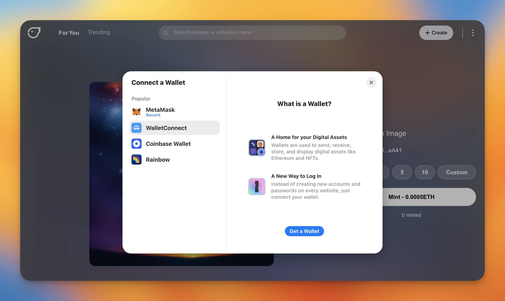
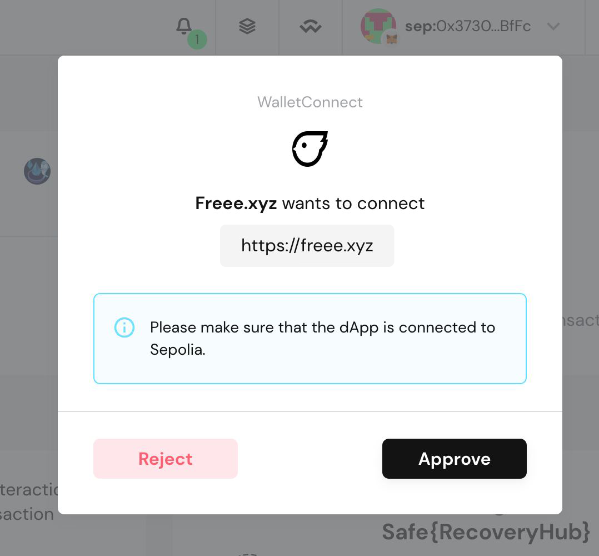

# Can I connect a multi-sig wallet?

The creator toolkit offers a simple and easy way for shared projects to create and manage their collection. Creating an edition that may have a shared group of owners or administrators, it can be beneficial for that group to use a multi-signature wallet to manage their collection. Creating a multi-sig wallet allows you to

* Spread decision-making across the group

* Not allow one wallet address to control all aspects of the collection.

* Reduce the risk of a member misusing funds or permissions

A service we recommend for setting up a multi-sig wallet is to use [gnosis safe](https://gnosis-safe.io/).

---

If you do not have a gnosis-safe wallet currently set up, you can access their help centre [here](https://help.gnosis-safe.io/en/collections/2289028-getting-started) to follow through with their process.

It is essential to make sure that you have set up your wallet with funds to approve and complete any necessary transactions.

* To connect your wallet, click "**connect wallet**" and select "**WalletConnect**".

  
* Select "**OPEN**" next to the title "Need the WalletConnect modal?"

* Copy the connection link by clicking "**Copy to clipboard icon**"

* From the homepage of your gnosis-safe, select "**Use Wallet Connect Icon**"

* Paste the connection link that you previously copied from create.freee into the text entry box

* Approve the connection to Freee. All delegates in your multi-sig wallet will need to approve this transaction. The transaction will be added to your ‘Transaction Queue’ while it is awaiting approval from all wallets.

* Once you see this on the safe page, return to the freee.xyz home page and your multi-sig wallet will now be connected.

**With the updates of Gnosis Safe and Wallet Connect, their page layouts may change, but the overall process remains the same.* *
