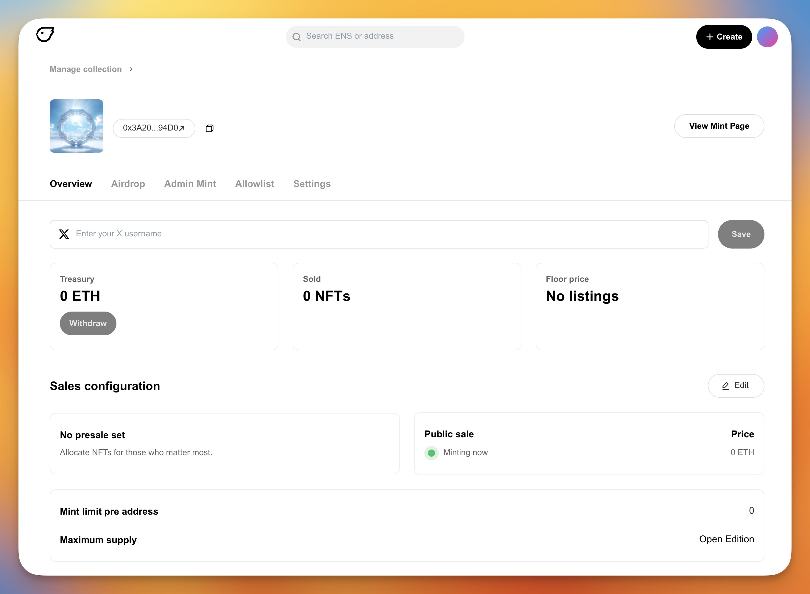

# How do I withdraw my earnings?

This article applies to both editions and drops

To begin, you'll need to access the "Manage collection" section. There are two way's that you can access your collection's settings:

1. The first is to navigate to the "Your Collections" page and select the collection you want to manage. A link to that page can be found [here]().

2. The second is to navigate from your collections mint page. To do this, select your wallet address/ENS name in the top right corner, then select "**Manage Collection**".

3. You will then be able to view the amount within your treasury 

4. To withdraw from the treasury, click "**Withdraw**"

This will then prompt a wallet transaction. Once this transaction is completed, you will receive the ETH in your wallet.