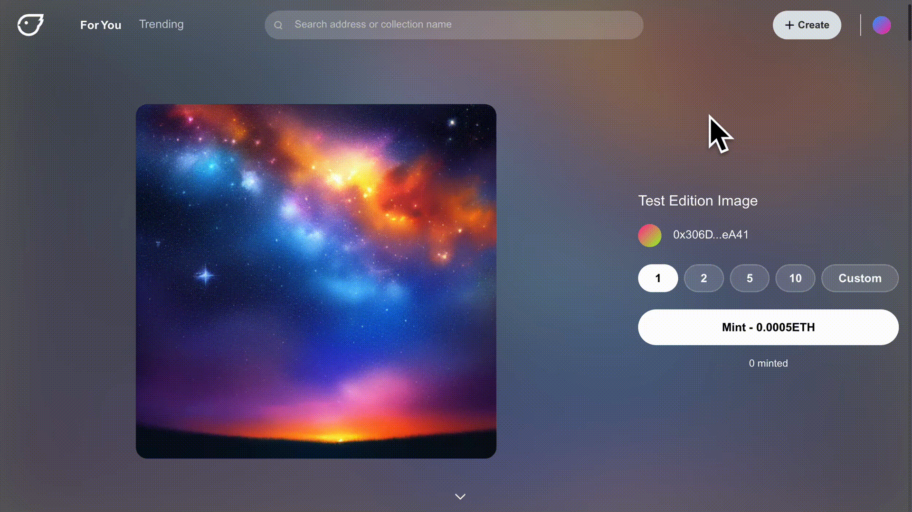
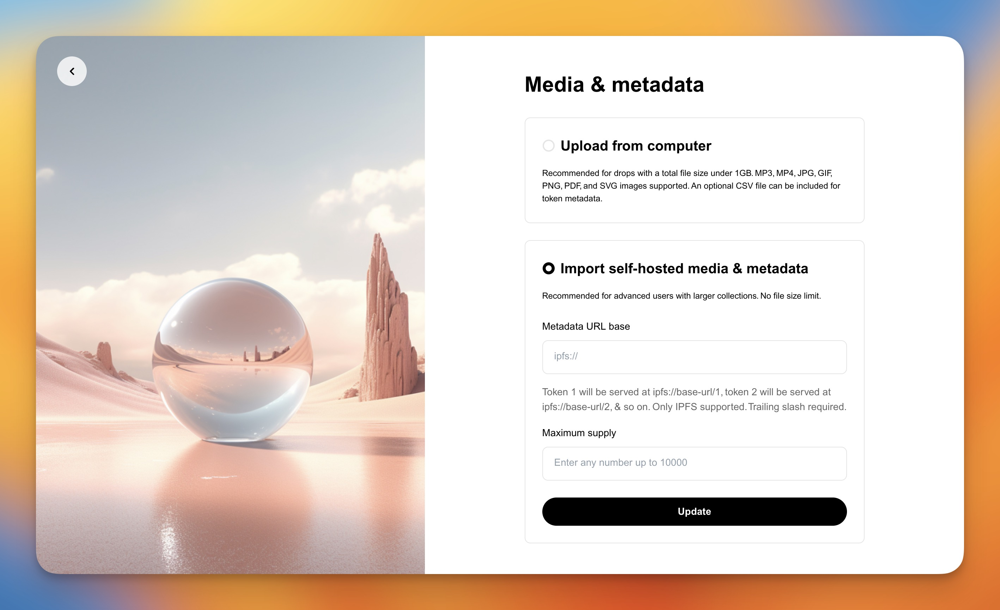
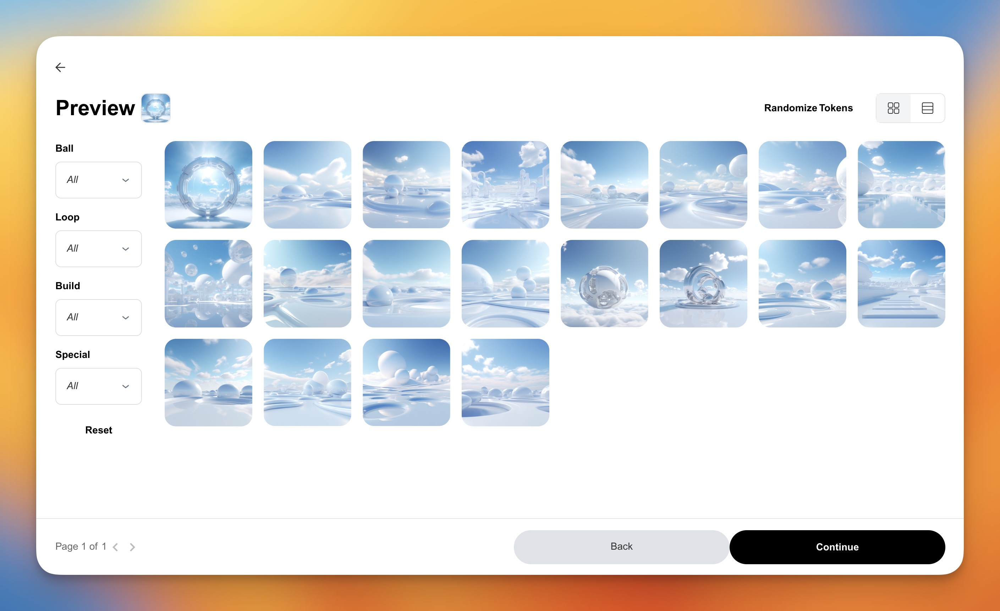
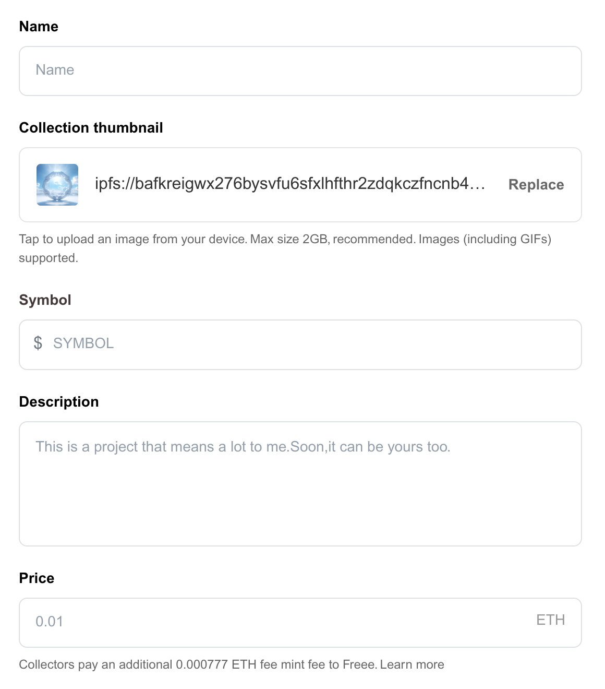
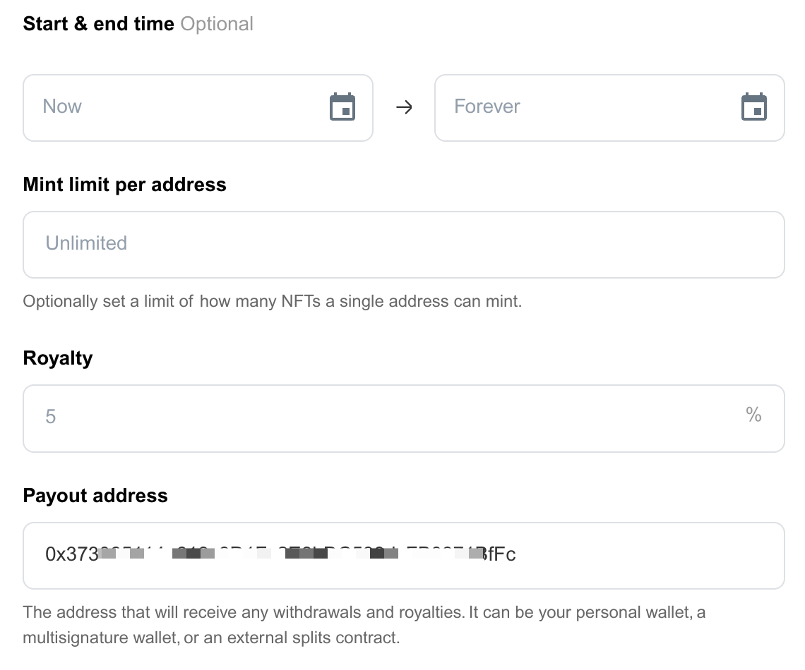

# How to create a Drop (ERC-721)

Freee provides an easy-to-use, no-code-required solution to mint, drop and manage NFT collections. A Drop collection can have unique artworks and metadata for each of the tokens in the collection. Images, Audio and Video file types are supported by our Drops tool.

## Want to test out your collection?

We recommend using our [testnet](https://testnet.freee.xyz) before setting your collection live. Testing on the testnet provides a risk-free environment where you can ensure that your collection functions correctly and identify any potential issues before they occur on the mainnet, saving your time and ETH.

***

## Creating your Drop

At Freee, we aim to make it as easy and enjoyable as possible for creators to bring their imagination and creativity onchain.

1. Connect your wallet to [freee.xyz](https://freee.xyz)
2. Follow this link here: [https://freee.xyz/create/drop](https://freee.xyz/create/drop)

***

## Uploading your Artwork

There are two ways that you can upload your drop to Freee:

1. The first is through "**Upload from computer**", which will prompt you to upload an artwork folder containing all your artwork and metadata.
2. The second is to "**Import self-hosted metadata**" upload using your IPFS links.

***

### 1. Upload from computer

To upload your artwork and metadata directly onto Freee, ensure that you have selected the "Upload from computer" tab and follow the instructions below:

Under the title "Media & metadata folder", click **"Replace"** and select your desired artwork folder. For best practice, download our example folder **OR** follow our in-depth guide here:

It is crucial to make sure that your folder is formatted correctly and has the following components:

1. A **media** folder containing all of all your artwork files
2. All artwork files are in the correct number order. e.g. 1.jpg, 2.jpg, 3.jpg, etc.
3. Check your file type; the following are supported for your drop.
   * Image: JPG, PNG, GIF, SVG
   * File: PDF
   * Video: MP4 (H.264 encoding is recommended)
   * Audio: MP3
4. Optional - **ONE** .csv file containing your collection’s metadata. An in-depth guide to formatting your .csv can be found here.
   * If you exclude the .csv file, the NFTs will get standard names and descriptions from your collection details.
5. Optional - A **thumbnails** folder containing the thumbnail(s) you wish to display on your non-image media (audio/video)
   1. if you are using non-image media (audio/video), you **must** use the thumbnail folder to upload images for marketplaces to display on list pages. By default they will match on filename `media/1.mp4 -> thumbnails/1.png`

or

Once your artwork folder has been successfully uploaded, select **"Continue"** at the bottom of the page.

***

### 2. Import Self-Hosted Metadata

To create your drop using a manual upload, ensure you have selected the "**Import self-hosted metadata**" tab. To manually upload your drop successfully, you will need to input the following components:

1. "**Metadata URI Base**" - A URL base that returns unique token metadata when appended with a token id (1, 2, 3, etc.). The URL base should end with a trailing slash and work without extensions.
2. "**Maximum Supply**" - Input the maximum supply for your collection.

Once you have input your information above, select "**Continue**" to create your drop.

\*_If you have a large collection of \~1000+, it can take a decent amount of time before your IPFS has synced correctly. If this issue persists for a long time, then please get in touch with our customer support._ \*

## Previewing your Drop

Now that your artwork has been uploaded, you will be taken to the "**Preview**" page, where you can check to ensure that your artwork and metadata have all been uploaded correctly.

At this stage, you can also randomize the order of your drop by selecting "**Randomize tokens**". Once you have checked that the metadata of your collection is correct, select "**Continue**" to begin inputting the details of your collection.

## Collection Details

Enter the details of your collection as listed below

\*Required Fields

<figure><figcaption></figcaption></figure>

1. Add the collection **Name** for your drop.\*
2. Upload a **Collection Thumbnail**. This field is used as a logo image on most marketplaces. 1080x1080px is recommended.
3. Enter the **Symbol** for your drop. The symbol acts as a token name for your drop and cannot be changed once your contract has been created.\*
4. Add a **description**: This can be any information you want to explain or add to your drop, including external links.\*
5. Select Network.
6. Set your **mint price**: Enter each edition's amount (ETH). The price can be updated once your edition has been created.

6. Optional - Set a **start & end time**: By default, drops will run forever from the moment they are created or until the drop sells out. You can select a custom start and/or end time for your drop.
7. Add a **mint limit** to your collection. Using this function, you can limit the number of NFTs each individual wallet address can mint.
8. Add the **Royalty**: The royalty is a feature the creator sets in the creation process. This feature is a permanent, fixed percent value sent to you on every sale.\*
9. Input a **Payout Address**: This will automatically fill with the connected wallet; however, it can be your personal wallet, a multi-signature wallet or an external split contract.

Now that you have filled out the details of your collection select "**Upload**" to finalize your drop.

## Finalize Collection

After selecting "**Upload**", you will be taken to the "**Finalize Collection**" page. The final step in creating your drop will be to click the "**Create**" button.

Once you click the "**Create**" button to finish creating your drop. This will prompt you to accept a gas fee and follow the steps below:

1. Approve the Gas fee: A message will appear within your connected wallet for you to approve the gas fee to complete the creation of your drop.
2. Wait for your transaction to complete: The upload process has begun once you’ve approved the transaction within your wallet. You can check the status of your upload by viewing the transaction on your relevant block explorer (e.g. Etherscan).
3. Drop Created: Once the transaction has been confirmed, your collection will be created and ready to share with your community.
