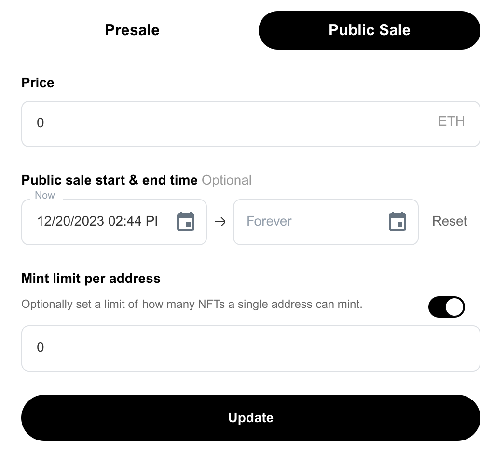

# Managing your Edition (ERC-721)

The ways that you can find you can manage your single-edition and access your collection's settings:

Navigate to your Dashboard and select the collection you want to manage. A link to that page can be found [here](https://freee.xyz/manage).

<figure><figcaption></figcaption></figure>

***

## Updating Information

In the "**Settings**" of your single edition, you can update its metadata and sale configuration. These include **price**, **the start and end date** and setting a **minting limit** per address for your collection.

You can also update the metadata of your collections, including the description, the file/artwork itself and the **cover image** of your collection.

Once you are satisfied with the changes you have made

* Click **update** under the appropriate section

This will prompt you to confirm with your wallet and **requires you to pay a gas fee**.

\*_Please note that anyone classified as an ADMIN can update and change this data_ \*

***

## Managing Permissions

As owner/admin of a single edition, you can update and change the permissions to your collection. This includes **payout addresses**, **managing permissions** of admin access, and the ability to **transfer ownership** to another wallet address.

Once you are satisfied with the changes you have made

* Click "**update**" or "**transfer**" under the appropriate section.
* Approve the Gas fee: A message will appear within your connected wallet for you to approve the gas fee to complete the update of your single edition. Gas fees are the cost of interacting with the Ethereum blockchain. Gas fees are not set or collected by Freee.
* Wait for your transaction to complete: Once you’ve approved the transaction within your wallet, the update process has begun. You can check the status of your upload by clicking the "View on Etherscan" link in your connected wallet.
* Once the transaction has been confirmed, your changes/updates will be made.
