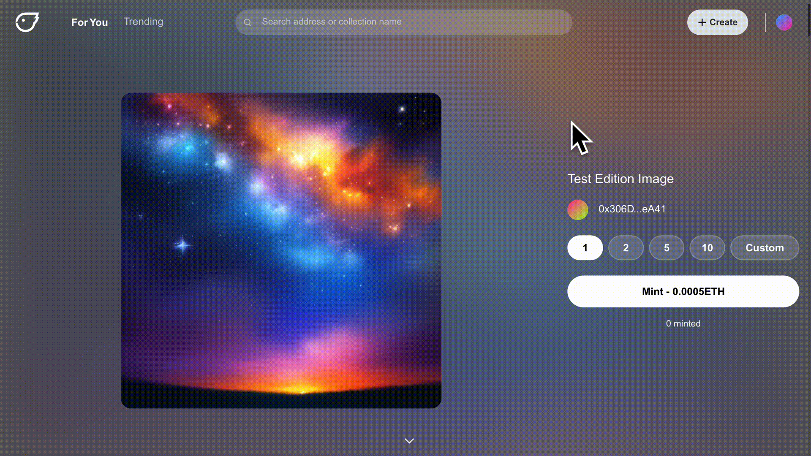
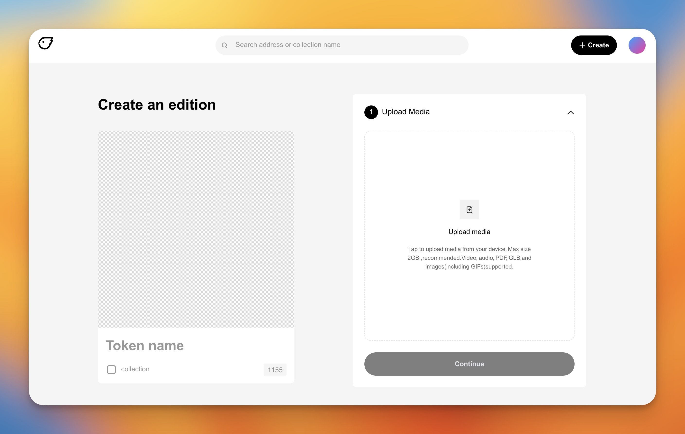

# How to Create a Multi-Edition

Using Freee's Multi-Edition tool, you can add editions to a single contract and release them over time or all at once. You have complete control over how you organize and roll out your project.

There are three components to a Freee collection: the collection contract as a whole, the editions, and the individual tokens within those editions.

## Want to test out your collection?

We recommend using our [testnet](https://testnet.freee.xyz) before deploying any collection to the mainnet. Testing on the testnet provides a risk-free environment where you can ensure that your collection functions correctly and identify any potential issues before they occur on the mainnet, saving your time and ETH.

***

## Creating your Multi-Edition (ERC-1155)

At Freee, our mission is to make it as easy and enjoyable as possible for creators to bring their imagination and creativity onchain. It's now even easier to realize value for your work on Freee with just an Ethereum wallet!

1. Connect your wallet to [Freee.xyz](https://freee.xyz/)
2. Click the **"Create"** Button in the top right corner to begin creating your collection.
3. Select **"Multi-Edition"** from the drop-down menu.

\*\*_Want to create a drop collection (ERC-721)? Follow our guide_ [_here_](../how-to-create-a-drop-erc-721/how-to-create-a-drop-erc-721.md)_._

***

## 1. Upload your Media

Upload the media files for your Edition. These files can be a video, gif, audio, PDF or image file type.

**There is a max file size of 2GB**. \*_The larger the file size, the longer it can take for your file to upload_

***

## 2. Enter your Basic Details

<figure><figcaption></figcaption></figure>

1. Enter the **name** of your edition. \*_Remember this will only show on this individual edition_
2. Enter a **description** for your edition. \*_Remember this will only show on this individual edition_
3. Choose **Edition Size**: You can choose between
   1. "Open" does not have a fixed number of editions, and the supply is unlimited.
   2. "Fixed" has a fixed number of tokens that can be minted.
4. Select Network.
5.  Enter a percentage amount for your resale royalty.

    \*This must be a whole number
6. Input a Payout Address: This will automatically fill with the connected wallet. This can be updated even after the collection has been created.
7. Optional: Add attributes to your edition.

***

## 3. Collection

**Add your token to a collection**. There are two options for adding your Edition to a collection.

1. The first is to add your edition to one of your existing edition collections. To do this, enter the contract address for your collection into the space provided.
2. If you have not yet created a collection **OR** would like to create a new one:
   1. Enter the title for your new Edition Collection.
   2. Add a description for your collection. \*\*_This will only show on the collection view and is separate from your individual edition's report._
   3. Add your collection thumbnail; this can be an image or a gif.

***

## 4. Sale Details

1. Set your **mint price**: Enter your desired amount in ETH. The price can be updated once your edition has been created.
2. Set a Mint **Start time**: You can choose between:
   1. "**Now**" will start your mint period immediately after deploying your edition.
   2. "**Future**" allows you to select your edition's custom start and/or end time.
3. Add a **Mint Limit** to your collection:
   1. "**Unlimited**" allows each wallet to mint as many of your NFTs as they want.
   2. "**Custom**" means you can limit the number of NFTs each wallet can mint.

***

## 5. Review & Create

Preview and check the collection information you have set. After confirming that it is correct, click the **Create button** to complete the creation of your collection.

This will prompt you to either accept a gas fee OR sign a signature request.

Collection created 🎉: Once the transaction has been confirmed, your collection will be created and ready to share with your community.
