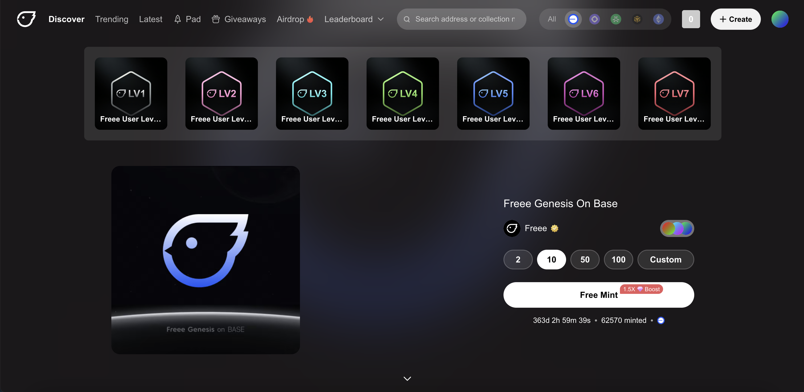
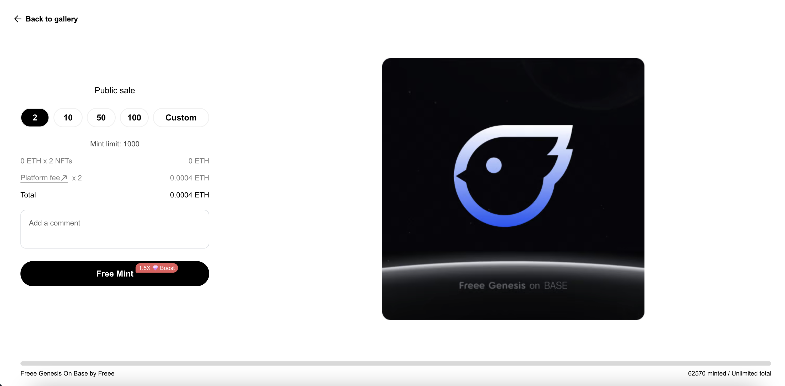

# How do I mint on Freee?

Where do I find NFTs to mint on Freee?

There are multiple places that you can mint on FREEE.

1. The first is to explore our [Discover](https://freee.xyz/), [Trending](https://freee.xyz/trending), [Latest](https://freee.xyz/latest), [Prime](https://freee.xyz/prime) and [Pad](https://freee.xyz/pad) feeds, where you can mint quickly and directly from collections. From here, you can quickly select the number of NFTs you want to mint or enter a custom amount.
2. You can also navigate through to a collections mint page either by clicking through our feeds or via a direct link that could be found on a creator's website, from a Twitter post or sent to you directly.

## How do I mint an NFT on FREEE?

#### 1. On Discover / Trending / Latest / Prime / Pad feeds

<figure><figcaption></figcaption></figure>

1. Click on "Mint" button
2.  Decide the amount of NFTs you want to mint. \
    The number of NFTs you can mint may also be affected by a mint limit set by the creator.

    For each NFT you mint, you will pay a Platform fee. This is per NFT and not per transaction. You learn more about our [mint fees](<../FREEE Mint & Collect Fees.md>) here.
3. Once you are ready, select "Mint" and confirm the transaction when prompted by your wallet. You’ll receive a notification once the transaction is completed successfully.

### 2. On Dedicated NFT Minting Page

<figure><figcaption></figcaption></figure>

1. Navigate to the mint page of a collection, and ensure that your wallet is connected.
2. From here, you can select **"Mint"**
3.  Decide the amount of NFTs you want to mint. \
    The number of NFTs you can mint may also be affected by a mint limit set by the creator.

    For each NFT you mint, you will pay a Platform fee. This is per NFT and not per transaction. You learn more about our [mint fees](<../FREEE Mint & Collect Fees.md>) here.
4. Once you are ready, select "mint" and confirm the transaction when prompted by your wallet. You’ll receive a notification once the transaction is completed successfully.

You have now minted your NFTs, and they will show in your wallet shortly 🎉
