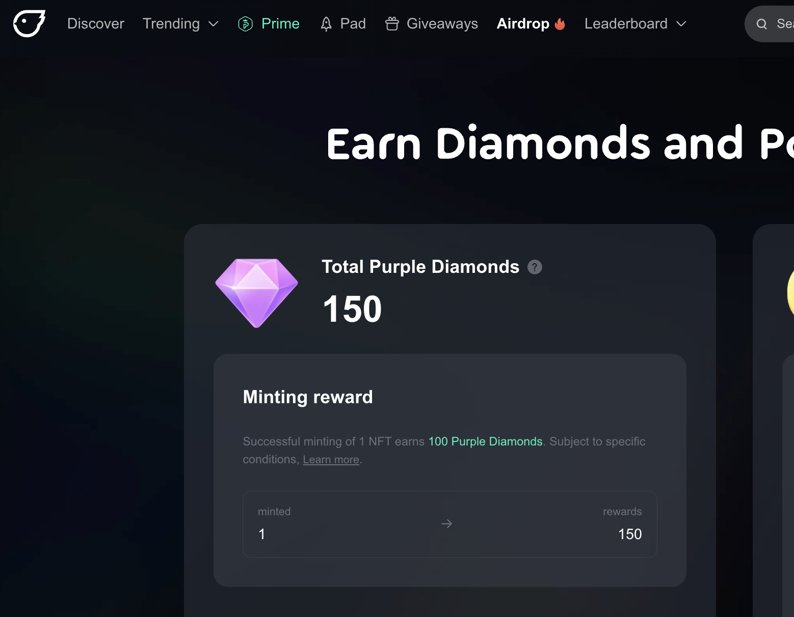

# How to collect to earn

Minters play a crucial role in the NFT ecosystem. By collecting NFTs, you not only support creators but also have the chance to earn rewards.

***

## Purple Diamonds

Receive 100 Purple Diamonds for every NFT you mint on Freee. You can check your Diamonds on the airdrop page.

<figure><figcaption></figcaption></figure>

**Potential Uses:**

* **Exclusive Access:** Purple Diamonds could grant access to special events or early previews of upcoming NFT drops.
* **Discounts:** Users may use Purple Diamonds to receive discounts on platform fees or on the purchase of select NFTs.
* **Status Symbol:** Accumulating Purple Diamonds could elevate a user's status within the community, unlocking badges or profile enhancements.
