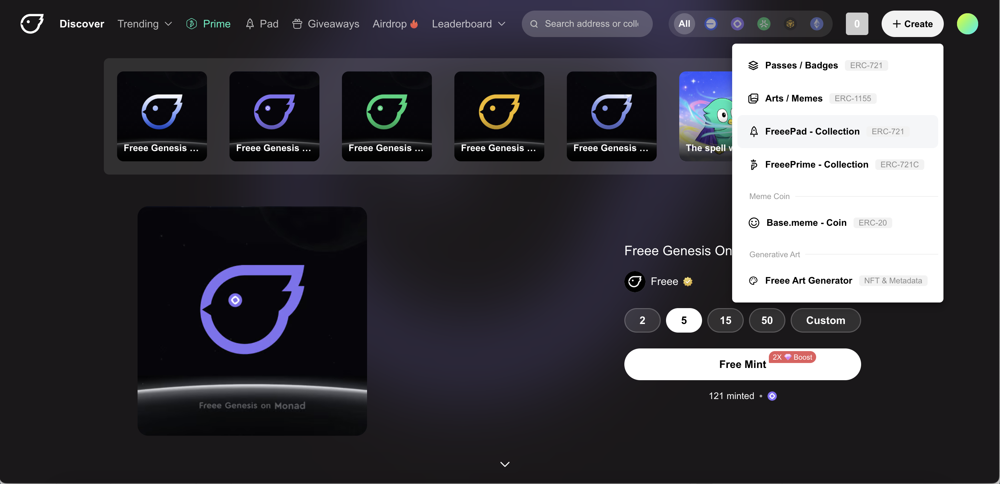
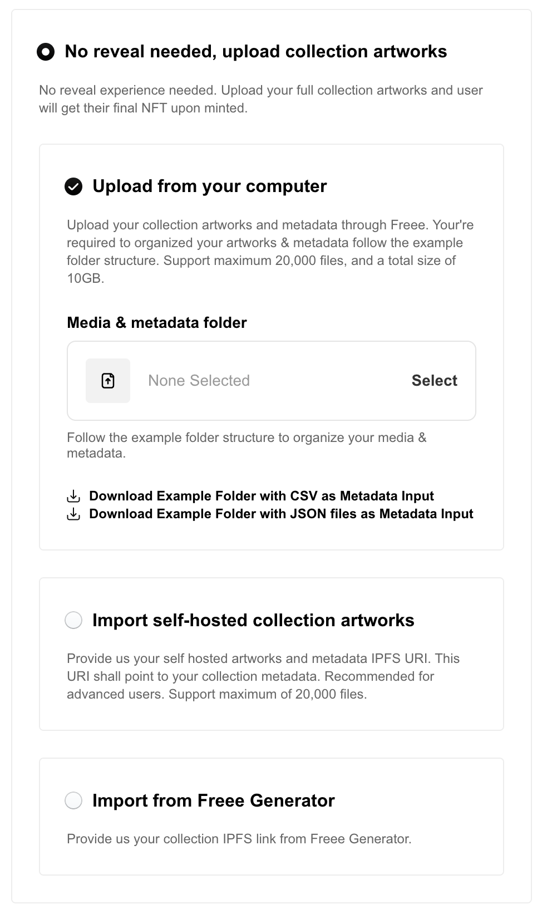
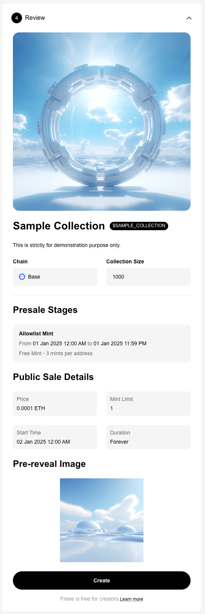

# How to create a collection (ERC721)

Freee provides an easy-to-use, no-code-required solution to launch and manage NFT project. A  collection provide full-fledged solution for NFT launching, by allowing multi minting stages, collection reveal experience, disable collection secondary market trading before mint out and etc. Creators will be able to have full control on how they gonna launch their collection.

***

## Creating your Collection

Follow the step-by-step guide below to get your collection setup on Freee in no time.

<figure><figcaption></figcaption></figure>

1. Connect your wallet on [freee.xyz](https://www.freee.xyz/)
2. Click the **"Create"** Button on the top right corner.
3. Select **"FreeePad - Collection"** from the drop-down menu.
4. Alternately, you may follow this link to get started: [https://freee.xyz/create/collection](https://freee.xyz/create/collection)

***

## Step 1: Fill in Collection Info

Fill in the details of your collection:

<figure><figcaption></figcaption></figure>

\*Required Fields

1. Fill in your collection **Name**. \*
2. **Select and upload** a **Collection Thumbnail** image for your collection. This image be use as cover image for your collection on Freee. \*
3. Enter the **Symbol** for your collection. The symbol acts as a token name for your drop and cannot be changed once your contract has been created. \*
4. Add a **description**, any information you want to share about your collection. You may include an external links. \*
5. Set your **Collection Size**, this is the total NFT supply in your collection. Please note that this is not edit-able after you deploy your contract. \*
6. Fill in the **Royalty**, the royalty is set by creator sets in the creation process to suggest a fixed percent value sent to you on every sale of your collection. \*
7. Input a **Payout Address**, wallet address to receive withdrawals & royalties, It will be default to  connected wallet; however, you can change it to a multi-signature wallet or an external split contract. \*
8. Select **Network** where you want to deploy your collection contract. \*

***

## Step 2: Setup Sale Stages

Most of the times, an NFT project will include multiple sale stages, including an Presale phase (sometimes called a “pre-mint”, “allowlist mint” or “whitelist mint”) that gives early access to those who are on the allowlist. Freee collection comes with 2 types of sale stages (minting stages).&#x20;

* **Presale Stages**: Allocate your collection to a specific groups of audience, called an “allowlist” who get the privilege to mint earlier or at a special price. A collection can setup up to 5 presale stages.&#x20;
* **Public Sale**: Everyone can mint your collection until mint out.

**Important**: Do note that if you haven't confirm your decision on sale stages, both Presale and Public Sale, you are till able to proceed by click on **Continue** button and set it up later in Collection management page.

<figure><figcaption></figcaption></figure>

### 2.1 Setup Presale Stage

Click on the Add a Presale button to start setting up.&#x20;

<figure><figcaption></figcaption></figure>

\*Required Fields

1. Enter **Stage** **Name** for your presale. \*
2. \[Optional] Set a **Stage Supply** if applicable. This limit the number of NFT that can be mint during this stage.
3. Set a **Stage Price,** enter your desired amount in ETH (or other selected chain currency). The price can be updated after your collection has been created.
4. Decide **Start & end time** of current presale stage. This is **optional during contract creation**, but you are require to setup afterward, else your collection Presale stage won't start.
5. Fill in **Mint limit per address** for current stage. This is **required**, presale stage need to have a default limit of number of NFT an allowlist address can mint. \*
6. Setup **Allowlist** for current stage, setup list of wallet addresses that allow to mint at current stage. You have option to upload an CSV (follow specified format) or enter all addresses manually. This is **optional during contract creation**, but you are require to setup afterward, else your collection Presale stage will be inactive.

### 2.2 Setup Public Sale

<figure><figcaption></figcaption></figure>

1. Set a **Price** for public sale, enter your desired amount in ETH (or other selected chain currency). The price can be updated after your collection has been created.
2. Decide **Start & end time** of public sale. This is **optional during contract creation**, but you are require to setup afterward, else your collection Presale stage won't start.
3. Fill in **Mint limit per address** for public sale. This is **optional**, leave empty if don't want to limit number of NFT a user can mint.

***

## Step 3: Prepare for Reveal Experience

**What is a reveal experience?**&#x20;

Sometimes, creator/project owner don’t reveal their artwork until after the project mint out. When user participate in the collection mint, the NFT everyone mints will at first look the same, which is placeholder pre-reveal artwork. The “real” NFT metadata and artwork will be “revealed” afterward when the creator/project owner updates the collection NFT’s metadata.

Freee provides 2 options for creator/project owner, where you get to decide whether you want a reveal experience for your collection or rather not to have.

<figure><figcaption></figcaption></figure>

### 3.1 Setup Reveal Experience

Select **I want reveal experience, setup pre-reveal** option.

<figure><figcaption></figcaption></figure>

\*Required Fields

1. Select and upload a **Pre-reveal Image**, this will be the image user get when the participate in mint before creator/project owner reveal the collection artworks. \*
2. Enter Pre-reveal Description, this description will be displayed as individual NFT description on secondary market before collection revealed. This is **optional**.

### 3.2 No reveal experience

Select **No reveal needed, upload collection artworks** option.

Creator/project owner are provided with 3 ways to upload collection artworks.&#x20;

<figure><figcaption></figcaption></figure>

Refer [How to upload collection artworks?](how-to-upload-collection-artworks.md) section for more details.

***

## Step 4: Review and Create

This is the last step for creating a Collection on Freee. You are required to review all the setup you done in previous steps and if no problem found, proceed to click on the **Create** button.

<figure><figcaption></figcaption></figure>

Once you click the "**Create**" button to finish creating your collection. This will prompt you to accept a gas fee, refer steps below:

1. An upload process will start automatically once you’ve approved the transaction within your wallet. This process is there to upload setup related to artwork onto decentralised storage.
2. After upload done, a message will appear within your connected wallet for you to approve the gas fee to complete the creation of your drop. Review and approve it, then wait for your transaction to complete.
3. Once the transaction has been confirmed and collection created, you're set to launch your NFT collection on Freee.

