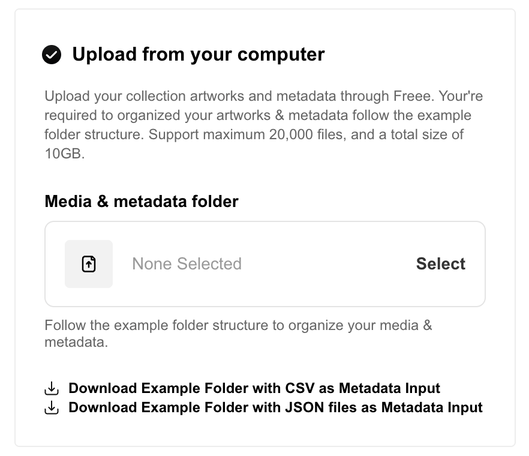
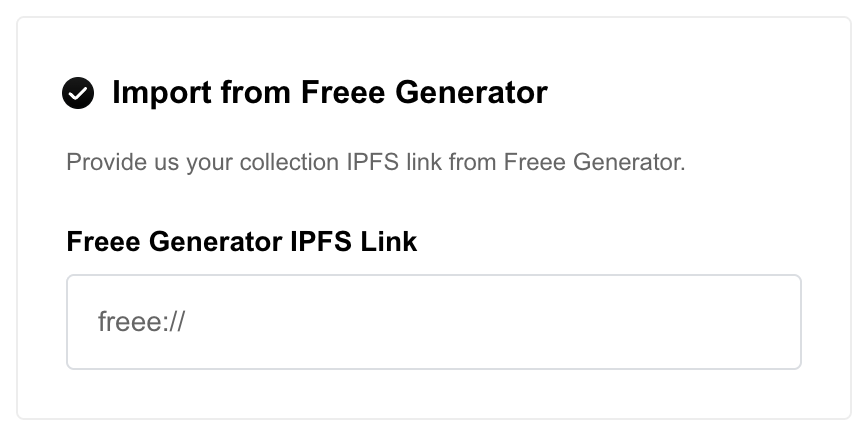

# How to upload collection artworks?

Freee provides creator/project owner with 3 ways to collection artworks, which is

1. "**Upload from computer**", which will prompt you to upload an artwork folder containing all your artwork and metadata.
2. "**Import self-hosted metadata**" where you provide IPFS link to your collection artwork metadata. Recommended for advance user only.
3. **"Import from Freee Generator"** which require you to enter your collection IPFS link generated by [Freee Generator](https://freee.art/).

## 1. Upload from computer

To upload your artwork and metadata directly onto Freee, select the "**Upload from computer**" option and follow instruction below:

<figure><figcaption></figcaption></figure>

### Prerequisites:

Prepare your artworks & metadata following required "format". For best practice, you may download our example folder **OR** follow our guide here.

First at all, make sure your folder contains following components:

1.  A **media** folder containing all of your artwork files.

    These files must be formatted correctly and numbered 1, 2, 3 and so on. \*_Ensure there are no hash marks (#) in the filename._
2.  Optional - A single **.csv** file containing your collection’s metadata.

    \*_If you exclude the .csv file, the NFTs will get default name and description from your collection details._
3.  Optional - A **thumbnails** folder containing the thumbnail(s) you would like to display on your non-image media (audio/video).

    _\*If you are using non-image media (audio/video), you **MUST** include the thumbnail folder to upload images for marketplaces to display on collection listing page. By default they will match on filename `media/1.mp4 -> thumbnails/1.png`_

Check out this [link](others/in-depth-outline-of-collection-artworks-folder.md) for in-depth outline about artworks folder.

Check out this [link](others/in-depth-outline-of-collection-metadata-csv.md) for in-depth outline about metadata CSV file.

***

### Steps:

1. **Select** your artworks folder and **Approve** permissions from your browser to read files on your computer
2.  You should see a **Preview** action below.

    <figure><figcaption></figcaption></figure>

    You may preview your artworks and make sure it's the right one before proceed.

    <figure><figcaption></figcaption></figure>

    You may randomize the order of your artworks by selecting "**Randomize tokens**".
3. You are good to go if everything looks fine!

***

## 2. Import self hosted collection artworks

To upload your artwork and metadata directly onto Freee, select the "**Import self-hosted collection artworks**" option and follow instruction below:

<figure><figcaption></figcaption></figure>

### Prerequisites:

1. Make sure you have uploaded your artworks & metadata to decentralised storage (IPFS). Freee accept only artworks that stored on IPFS and no other options.
2. Make sure your uploaded artworks & metadata meet the amount needed for your collection (collection size / total supply). Freee will validate provided IPFS URI to confirm it contains enough amount of artworks.

_\*We recommended this for advanced ceator/project owner who want to maintain their artworks on own decentralised storage services._

### Steps:

1. Fill in **Metadata URI** for your artworks. This shall points to the metadata of your artworks. The URI base should end with a trailing slash and work without extensions.
2. A validation will run automatically once you done entering your Metadata URI.
3. You are good to go if you see a validation success message.

## 3. **Import from Freee Generator**

Enter the provided IPFS link from [Freee Generator](https://freee.art/)

<figure><figcaption></figcaption></figure>

***

