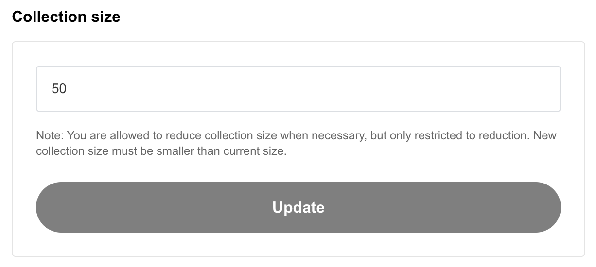
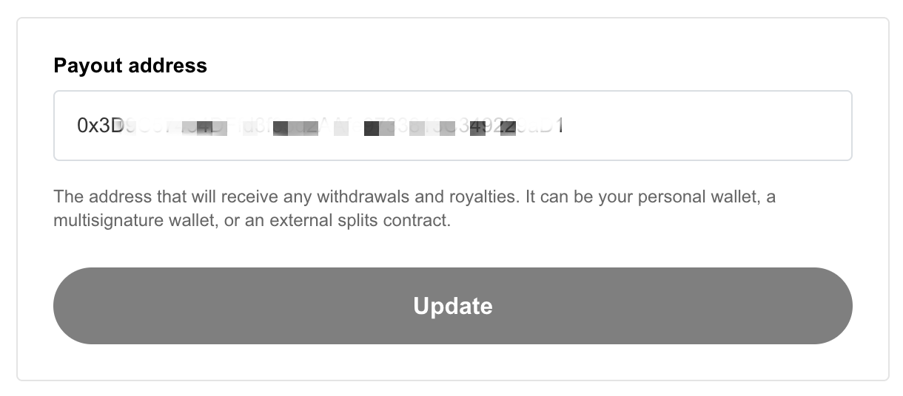

# General Settings

As owner/admin of a collection, you can update and change general settings of your collection.&#x20;

### 1. Change Collection size

<figure><figcaption></figcaption></figure>

You may update your collection size when necessary, but only reductions are allowed.&#x20;

***

### 2. Update Collection Metadata (Cover Image & Description)

<figure><figcaption></figcaption></figure>

Your collection cover image (Collection thumbnail) and description on Freee are update-able. Follow steps below, if you wish to change your cover image to something else or update the description about your collection

1. Click on **Replace** and select a new image \[optional]
2. Change the text inside **Description** field \[optional]
3. Once you updated either part, the Update button will turn active. Click on **Update** button once you're satisfied with your changes
4.  **Approve** the Gas fee.

    A message will appear within your connected wallet for you to approve the gas fee to complete the update. Gas fees are the cost of interacting with the blockchain. Gas fees are not set or collected by Freee.

***

### 3. Change Payout Address

<figure><figcaption></figcaption></figure>

Payout address is address that will receive any withdrawal (collection minting fee) and royalties (from secondary market) for your collection. This address can be a personal wallet address, a multisig wallet address or even an external splits contract address. To update:

1. **Enter** new payout address. Do MAKE SURE this address is correct.
2. Click on the **Update** button.
3.  **Approve** the Gas fee.

    A message will appear within your connected wallet for you to approve the gas fee to complete the update. Gas fees are the cost of interacting with the blockchain. Gas fees are not set or collected by Freee.

***

### 4.1 Add New Team Member

<figure><figcaption></figcaption></figure>

Add a team member to help managing your collection. Team member will have the right to edit sale stages configuration, update collection metadata, toggle lock trading and change payout address. To add a new team member:

1. **Enter** team member wallet address into provided field. Be sure check the wallet address carefully and make sure it's the right one.
2. Click on **Add** button.
3.  **Approve** the Gas fee.

    A message will appear within your connected wallet for you to approve the gas fee to complete the update. Gas fees are the cost of interacting with the blockchain. Gas fees are not set or collected by Freee.
4. Your team member will now be able to view and manage your collection once they login on Freee.

***

### 4.2 Remove Team Member

<figure><figcaption></figcaption></figure>

To remove a team member from collaborating in your collection:

1. **Click** on the more button on the right side of selected member wallet address.
2. Click on the **Remove admin** button.
3.  **Approve** the Gas fee.

    A message will appear within your connected wallet for you to approve the gas fee to complete the update. Gas fees are the cost of interacting with the blockchain. Gas fees are not set or collected by Freee.
4. Selected member is now removed from accessing the collection after transaction successful.&#x20;

***

### 5. Transfer Contract Ownership

<figure><figcaption></figcaption></figure>

You can transfer the ownership of your collection contract to another wallet address. Advice to **Operate with Caution** as this may cause you to lost full access / control to your collection.

1. **Enter** new wallet address into provided field. Be sure to **RE-ASSURE** that the new wallet address provided it's the right one.
2. Click on the **Transfer** button.
3.  **Approve** the Gas fee.

    A message will appear within your connected wallet for you to approve the gas fee to complete the update. Gas fees are the cost of interacting with the blockchain. Gas fees are not set or collected by Freee.

***
